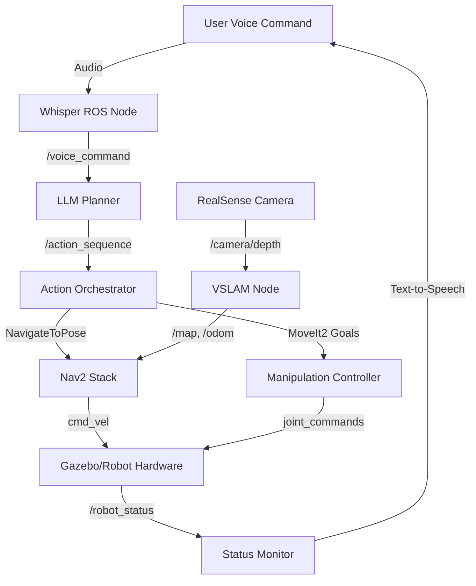

# System Architecture

End-to-end VLA pipeline design and data flow.

## High-Level Architecture



## Component Breakdown

### 1. Speech Recognition Layer

**Node**: `whisper_ros_node.py`
- **Input**: Microphone audio stream
- **Output**: `/voice_command` (std_msgs/String)
- **Model**: Whisper base (74M parameters)
- **Latency**: ~500ms per command

### 2. Task Planning Layer

**Node**: `llm_planner.py`
- **Input**: `/voice_command`
- **Output**: `/action_sequence` (JSON action list)
- **Model**: GPT-4 or Llama 2 7B
- **Latency**: 1-2 seconds

**Action Grammar:**
```json
{
  "actions": [
    "navigate(location_name)",
    "pick(object_name)",
    "place(location_name)",
    "wait(seconds)",
    "speak(text)"
  ],
  "estimated_time": 120
}
```

### 3. Action Execution Layer

**Node**: `action_orchestrator.py`
- **Input**: `/action_sequence`
- **Output**: Multiple ROS 2 action clients
- **Function**: Sequential action execution with error handling

**Supported Actions:**
- `navigate(kitchen)` → Calls Nav2 `/navigate_to_pose`
- `pick(cup)` → Calls MoveIt2 `/pickup` action
- `place(table)` → Calls MoveIt2 `/place` action

### 4. Navigation Stack

**Components:**
- **VSLAM**: Isaac ROS Visual SLAM or ORB-SLAM3
- **Localization**: AMCL or VSLAM-based
- **Path Planning**: Nav2 Planner Server (Smac Hybrid A*)
- **Control**: Nav2 Controller Server (DWB)
- **Recovery**: Backup, Spin, Wait behaviors

### 5. Manipulation Stack

**Components:**
- **Motion Planning**: MoveIt2 with OMPL
- **Grasp Planning**: GPD or simple geometric grasps
- **Gripper Control**: Position or effort control

### 6. Perception Stack

**Sensors:**
- **RealSense D435i**: RGB-D + IMU
- **Microphone**: USB audio input

**Processing:**
- **Object Detection**: YOLOv8 or Grounding DINO
- **Depth Estimation**: RealSense SDK
- **Speech Recognition**: Whisper

## Data Flow Example

**Command**: "Robot, go to the kitchen and pick up the cup"

1. **Whisper**: Audio → "go to the kitchen and pick up the cup"
2. **LLM Planner**:
   ```json
   {
     "actions": [
       "navigate(kitchen)",
       "pick(cup)",
       "navigate(user)",
       "place(user)",
       "speak('Task completed')"
     ]
   }
   ```
3. **Orchestrator**: Executes each action sequentially
4. **Nav2**: Plans path to kitchen, publishes `/cmd_vel`
5. **Gazebo/Robot**: Executes motion
6. **Status Monitor**: Reports "Arrived at kitchen"
7. **MoveIt2**: Plans grasp, moves arm
8. **Gripper**: Closes on cup
9. **Nav2**: Returns to user
10. **MoveIt2**: Places cup
11. **TTS**: "Task completed"

## Failure Modes

| Failure | Detection | Recovery |
|---------|-----------|----------|
| Speech unclear | Low Whisper confidence | Request repeat |
| Invalid action | JSON validation fails | Ask for clarification |
| Nav goal unreachable | Nav2 returns failure | Request alternative location |
| Object not found | Detection timeout | Ask user for help |
| Grasp fails | Force sensor threshold | Retry with different approach |

## Performance Targets

- **Voice → Action latency**: &lt;3 seconds
- **Navigation success rate**: >90%
- **LLM valid actions**: >95%
- **System uptime**: >60 minutes continuous operation

## Deployment Modes

### Simulation Mode
- Gazebo physics engine
- Simulated sensors (RGB-D, IMU, microphone via host)
- No real hardware required

### Hardware Mode
- Real sensors (RealSense, USB mic)
- Jetson Orin edge compute
- Physical robot platform
- Safety limits enabled

## Next Steps

See Implementation for step-by-step integration guide.
