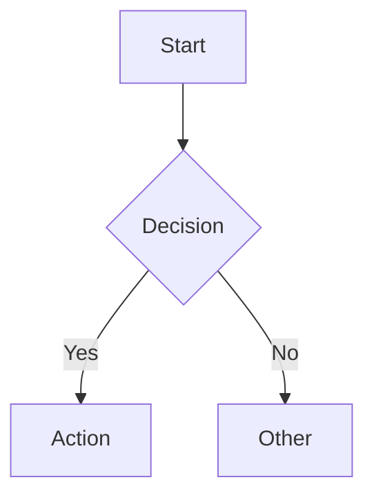
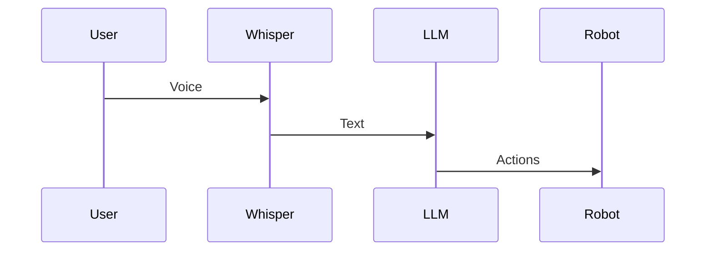
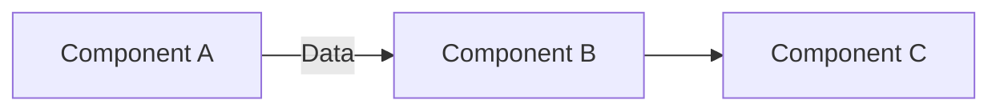

# Contributing Guidelines

Help improve this e-book by contributing lessons, code examples, or fixes.

## How to Contribute

### 1. Content Types

**Lessons** - Educational markdown files
**Code Examples** - Python/launch files with full documentation
**Diagrams** - Mermaid diagrams for architecture/flow
**Citations** - Research papers, official docs, tutorials

### 2. Before Contributing

- Read existing modules to understand style
- Check GitHub Issues for requested content
- Discuss major changes in Discussions first
- Fork the repository

### 3. Contribution Workflow

```bash
# Fork and clone
git clone https://github.com/YOUR_USERNAME/hackathon-book-proj.git
cd hackathon-book-proj/my-website

# Create feature branch
git checkout -b add-lesson-slam-tuning

# Make changes
# Test locally
npm install
npm run start

# Commit and push
git add .
git commit -m "Add SLAM tuning lesson to Module 3"
git push origin add-lesson-slam-tuning

# Create Pull Request on GitHub
```

## Writing Lessons

### Lesson Format

All lessons must follow this structure:

```markdown
---
id: unique-id
title: "Lesson Title"
sidebar_position: 2
---

# Lesson Title

Brief 1-2 sentence description.

## Section 1

Bullet points preferred over long paragraphs.

## Code Example

\`\`\`python
# Well-commented code
def example_function():
    """Docstring explaining function."""
    pass
\`\`\`

## Mermaid Diagram (if applicable)

\`\`\`mermaid
graph TD
    A[Start] --> B[End]
\`\`\`

## Troubleshooting

| Issue | Solution |
|-------|----------|
| Error X | Fix Y |

## Next Steps

Link to next lesson or related content.
```

### Style Guidelines

**Length:**
- Lessons: 250-400 words
- Use bullet points, tables, code blocks
- Avoid long paragraphs

**Tone:**
- Clear, concise, instructional
- Assume reader has Module 1 knowledge
- Define all acronyms on first use

**Code:**
- Include docstrings for all functions
- Add inline comments for complex logic
- Provide usage examples

**Formatting:**
- Use HTML entities for special chars: `&lt;` not `<`
- Escape all `<` before numbers: `&lt;5 seconds`
- Use fenced code blocks with language tags

### Flesch-Kincaid Readability

**Target: Grade 9-12**

Check readability:
```bash
# Install textstat
pip3 install textstat

# Check file
python3 -c "
import textstat
with open('docs/module-01/01-setup.md') as f:
    text = f.read()
    score = textstat.flesch_kincaid_grade(text)
    print(f'Flesch-Kincaid Grade: {score}')
"
```

**Tips for readability:**
- Use shorter sentences (10-15 words)
- Avoid jargon where possible
- Active voice preferred
- One idea per sentence

## Code Example Format

### File Naming

- Use snake_case: `whisper_ros_node.py`
- Descriptive names: `send_nav_goal.py` not `script1.py`
- Place in `examples/` subdirectory

### Required Elements

```python
#!/usr/bin/env python3
"""
Module Name

Brief description of what this code does.

Usage:
  ros2 run package_name script_name.py
  OR
  python3 script_name.py --arg value

Dependencies:
  - ros-humble-nav2-bringup
  - python3-openai
"""

import rclpy
from rclpy.node import Node

class ExampleNode(Node):
    """One-line class description."""

    def __init__(self):
        super().__init__('example_node')
        # Initialize with comments

    def callback(self, msg):
        """Handle incoming messages."""
        pass

def main(args=None):
    rclpy.init(args=args)
    node = ExampleNode()

    try:
        rclpy.spin(node)
    except KeyboardInterrupt:
        pass
    finally:
        node.destroy_node()
        rclpy.shutdown()

if __name__ == '__main__':
    main()
```

### Code Quality Checklist

- [ ] Docstrings for all functions/classes
- [ ] Inline comments for complex logic
- [ ] Usage example in header comment
- [ ] Error handling with try/except
- [ ] Proper cleanup (destroy_node, shutdown)
- [ ] No hardcoded paths (use parameters)
- [ ] PEP 8 compliant (check with `flake8`)

## Citation Requirements

### Format: APA 7th Edition

**Official Documentation:**
```
Open Robotics. (2023). *ROS 2 Humble Documentation*. https://docs.ros.org/en/humble/
```

**Research Papers:**
```
Smith, J., & Doe, A. (2023). Paper title. *Journal Name*, 10(2), 123-145. https://doi.org/10.1234/example
```

**Software:**
```
OpenAI. (2023). *Whisper* (Version 1.0) [Computer software]. GitHub. https://github.com/openai/whisper
```

### Citation Checklist

Each module must have `sources.md` with:
- [ ] Minimum 10 official documentation sources
- [ ] Minimum 5 technical sources (blogs, tutorials)
- [ ] All sources in APA 7th edition format
- [ ] Sources organized by type (Official, Technical, Research, Software)
- [ ] All URLs verified and working

### Adding Citations

```markdown
## Official Documentation

Author/Organization. (Year). *Title*. URL

## Technical Sources

Author. (Year, Month Day). *Title*. Publication. URL

## Research Papers

Authors. (Year). Title. *Journal*, Volume(Issue), Pages. DOI

## Software & Tools

Developer. (Year). *Software Name* (Version) [Computer software]. Platform. URL
```

## Diagrams (Mermaid)

### Supported Diagram Types

**Flowcharts:**


**Sequence Diagrams:**


**Architecture Diagrams:**


### Diagram Guidelines

- Keep diagrams simple (5-10 nodes max)
- Use clear, concise labels
- Include in lesson markdown (not separate files)
- Test rendering with `npm run start`

## Testing Your Contribution

### 1. Build Test

```bash
cd my-website
npm run build
# Must complete with 0 errors
```

### 2. Code Example Test

```bash
# Create test workspace
mkdir -p ~/test_ws/src
cd ~/test_ws/src
# Copy your code example
colcon build
source install/setup.bash

# Test execution
ros2 run package_name script_name.py
```

### 3. Link Check

```bash
# Install markdown-link-check
npm install -g markdown-link-check

# Check all links
find docs -name "*.md" -exec markdown-link-check {} \;
```

### 4. Readability Check

```bash
pip3 install textstat
python3 scripts/check-readability.py docs/your-new-lesson.md
# Target: Flesch-Kincaid Grade 9-12
```

## Pull Request Guidelines

### PR Title Format

```
[Module X] Add/Update/Fix: Brief description

Examples:
[Module 3] Add: SLAM tuning lesson
[Module 4] Fix: Whisper node microphone index
[Docs] Update: Contributing guidelines
```

### PR Description Template

```markdown
## Summary
Brief description of changes.

## Changes
- Added X lesson to Module Y
- Updated Z code example with error handling
- Fixed typo in A

## Testing
- [ ] `npm run build` passes
- [ ] Code examples tested on Ubuntu 22.04
- [ ] Readability score: X (target: 9-12)
- [ ] All links working

## Screenshots (if applicable)
Include before/after or new content screenshots.
```

### Review Process

1. Maintainer reviews within 3-5 days
2. Address feedback and push updates
3. Once approved, PR will be merged
4. You'll be credited in contributors list

## Code of Conduct

- Be respectful and constructive
- Focus on technical merit
- Help beginners learn
- No discrimination or harassment
- Follow ROS community guidelines

## Questions?

- Open a GitHub Discussion for questions
- Check existing Issues before creating new ones
- Tag maintainers with `@username` for urgent issues

## Recognition

Contributors will be:
- Listed in `CONTRIBUTORS.md`
- Credited in module sources (if major contribution)
- Invited to join maintainer team (after 3+ PRs)

Thank you for contributing! 🤖
