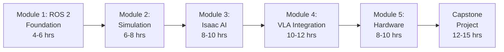

# Welcome to Physical AI & Humanoid Robotics

Master the complete stack for building intelligent physical AI systems: from ROS 2 fundamentals through advanced simulation to vision-language-action integration.

## What You'll Learn

This e-book provides a hands-on learning path for Physical AI and humanoid robotics, covering:

- **ROS 2 Fundamentals**: Nodes, topics, services, actions, and URDF modeling
- **Simulation Environments**: Gazebo Garden, Unity, and NVIDIA Isaac Sim
- **AI Perception**: Visual SLAM, Nav2 navigation, and synthetic data generation
- **Vision-Language-Action (VLA)**: Voice commands → LLM planning → robot execution
- **Hardware Deployment**: Workstation setup, Jetson edge compute, and real robot integration

## Target Audience

This e-book is designed for:

- **Students** learning robotics and AI fundamentals
- **Educators** teaching ROS 2 and physical AI courses
- **Intermediate Developers** (1-3 years experience) transitioning to embodied AI
- **Robotics Engineers** exploring humanoid systems and VLA workflows

## Prerequisites

Before starting, you should have:

- **Operating System**: Ubuntu 22.04 LTS (native, VM, or dual-boot)
- **Programming**: Basic Python knowledge (variables, functions, classes)
- **Command Line**: Familiarity with terminal/bash commands
- **Hardware**: 4GB+ RAM, 20GB free disk space
- **Optional**: RTX GPU for Isaac Sim and VLA modules (Modules 3-4)

No prior ROS or robotics experience required! We start from the basics.

## Learning Path

The e-book is organized into 5 progressive modules plus a capstone project.

**Total Estimated Time**: 38-48 hours (includes all modules + capstone)

### Module Overview

1. **Module 1 - ROS 2 Foundation** (4-6 hours)
   - Install ROS 2 Humble on Ubuntu 22.04
   - Create nodes, topics, services, and actions
   - Build basic URDF robot models
   - Visualize in RViz2

2. **Module 2 - Simulation** (6-8 hours)
   - Gazebo Garden physics simulation
   - Unity visual fidelity and HRI
   - Sensor configurations and robot spawning

3. **Module 3 - Isaac AI** (8-10 hours)
   - NVIDIA Isaac Sim setup
   - Visual SLAM and Nav2 navigation
   - Synthetic data generation for AI training

4. **Module 4 - VLA Integration** (10-12 hours)
   - Whisper voice recognition
   - LLM task planning (OpenAI or local Llama)
   - Voice → Action pipeline with ROS 2

5. **Module 5 - Hardware Deployment** (8-10 hours, Optional)
   - Workstation and Jetson setup
   - Real robot platforms (Unitree Go2, ROBOTIS OP3)
   - Sim-to-real transfer

6. **Capstone Project** (12-15 hours)
   - End-to-end system integration
   - Voice → Whisper → LLM → Navigation → Manipulation
   - Comprehensive troubleshooting and testing

## How to Use This E-Book

- **Sequential Learning**: Complete modules in order (1 → 2 → 3 → 4 → 5)
- **Independent Modules**: Each module is self-contained and testable
- **Hands-On Examples**: All code examples are tested on Ubuntu 22.04
- **Progressive Hardware**: Modules 1-2 run on CPU, Modules 3-4 require GPU

## Getting Started

Ready to begin? Head to **[Module 1: ROS 2 Foundation](./module-01-ros2/index.md)** to start your Physical AI learning journey!

## Support & Resources

- **GitHub Repository**: [hackathon-book-proj](https://github.com/yourusername/hackathon-book-proj)
- **Issues & Questions**: [GitHub Issues](https://github.com/yourusername/hackathon-book-proj/issues)
- **ROS 2 Answers**: [answers.ros.org](https://answers.ros.org/)
- **NVIDIA Isaac Forum**: [forums.developer.nvidia.com/c/isaac](https://forums.developer.nvidia.com/c/agx-autonomous-machines/isaac/)
