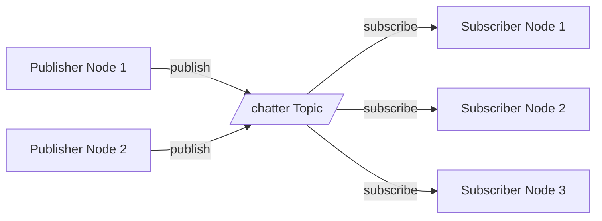
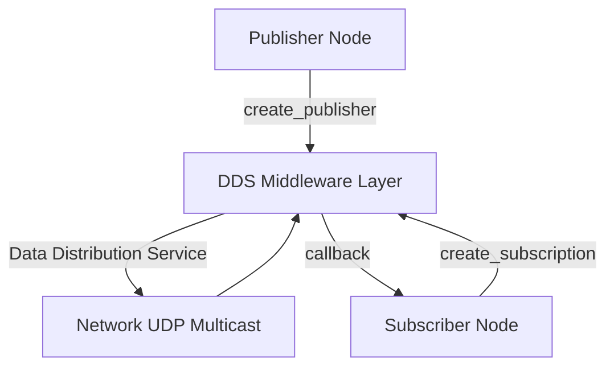

# Lesson 2: Nodes and Topics

Master the publish-subscribe communication pattern in ROS 2 through nodes and topics.

## Learning Objectives

- Understand what ROS 2 nodes are and why they matter
- Learn the publish-subscribe pattern for asynchronous communication
- Create publisher and subscriber nodes in Python
- Inspect running nodes and topics using ROS 2 CLI tools
- Visualize node communication with Mermaid diagrams

## Prerequisites

import CalloutBox from '@site/src/components/CalloutBox';

<CalloutBox type="prerequisite" title="Before You Begin">

- Completed [Lesson 1: ROS 2 Installation](./01-installation.md)
- ROS 2 Humble environment sourced (`source /opt/ros/humble/setup.bash`)
- Basic Python knowledge (classes, functions)

</CalloutBox>

## What is a Node?

A **node** is an executable process that performs a specific task in your robot system. Nodes are the fundamental building blocks of ROS 2 applications.

**Examples of nodes**:
- Camera driver node (publishes image data)
- Object detection node (subscribes to images, publishes detected objects)
- Motor controller node (subscribes to velocity commands, controls hardware)

### Key Principles

1. **Single Responsibility**: Each node does one thing well
2. **Loose Coupling**: Nodes communicate via standardized messages, not direct function calls
3. **Modularity**: Nodes can be developed, tested, and deployed independently

<CalloutBox type="tip" title="Design Pattern">

Think of nodes like microservices in distributed systems - they're independent processes that collaborate through message passing.

</CalloutBox>

## What is a Topic?

A **topic** is a named bus for transporting messages between nodes using the **publish-subscribe** pattern.

### Publish-Subscribe Pattern



**Key characteristics**:
- **Many-to-many**: Multiple publishers can write to the same topic, multiple subscribers can read
- **Asynchronous**: Publishers don't wait for subscribers
- **Decoupled**: Publishers and subscribers don't need to know about each other
- **Typed**: Each topic has a specific message type (e.g., `std_msgs/String`, `sensor_msgs/Image`)

## Creating Your First Publisher

Let's create a simple publisher node that sends "Hello World" messages.

**File**: `examples/publisher.py` (see full code in [Examples](#hands-on-examples))

### Publisher Code Walkthrough

```python
import rclpy
from rclpy.node import Node
from std_msgs.msg import String

class MinimalPublisher(Node):
    def __init__(self):
        super().__init__('minimal_publisher')
        self.publisher_ = self.create_publisher(String, 'chatter', 10)
        self.timer = self.create_timer(1.0, self.timer_callback)
        self.i = 0

    def timer_callback(self):
        msg = String()
        msg.data = f'Hello World: {self.i}'
        self.publisher_.publish(msg)
        self.get_logger().info(f'Publishing: "{msg.data}"')
        self.i += 1

def main(args=None):
    rclpy.init(args=args)
    node = MinimalPublisher()
    rclpy.spin(node)
    node.destroy_node()
    rclpy.shutdown()

if __name__ == '__main__':
    main()
```

### Code Breakdown

| Line | Explanation |
|------|-------------|
| `import rclpy` | ROS 2 Python client library |
| `from rclpy.node import Node` | Base class for all ROS 2 nodes |
| `from std_msgs.msg import String` | Standard string message type |
| `super().__init__('minimal_publisher')` | Initialize node with name `minimal_publisher` |
| `self.create_publisher(String, 'chatter', 10)` | Create publisher: message type `String`, topic `chatter`, queue size 10 |
| `self.create_timer(1.0, self.timer_callback)` | Call `timer_callback` every 1.0 seconds |
| `self.publisher_.publish(msg)` | Send message to topic |
| `rclpy.spin(node)` | Keep node running until interrupted (Ctrl+C) |

<CalloutBox type="info" title="Queue Size">

The queue size (10) determines how many messages to buffer if subscribers can't keep up. Larger values = more memory, fewer dropped messages.

</CalloutBox>

## Creating Your First Subscriber

Now let's create a subscriber that listens to the `chatter` topic.

**File**: `examples/subscriber.py` (see full code in [Examples](#hands-on-examples))

### Subscriber Code Walkthrough

```python
import rclpy
from rclpy.node import Node
from std_msgs.msg import String

class MinimalSubscriber(Node):
    def __init__(self):
        super().__init__('minimal_subscriber')
        self.subscription = self.create_subscription(
            String,
            'chatter',
            self.listener_callback,
            10
        )

    def listener_callback(self, msg):
        self.get_logger().info(f'I heard: "{msg.data}"')

def main(args=None):
    rclpy.init(args=args)
    node = MinimalSubscriber()
    rclpy.spin(node)
    node.destroy_node()
    rclpy.shutdown()

if __name__ == '__main__':
    main()
```

### Key Differences from Publisher

| Component | Publisher | Subscriber |
|-----------|-----------|------------|
| Creation method | `create_publisher()` | `create_subscription()` |
| Sends data via | `publish(msg)` | N/A (receives via callback) |
| Receives data via | N/A | `listener_callback(msg)` |
| Timing | Timer-driven (active) | Event-driven (passive) |

## Running the Publisher and Subscriber

### Terminal 1: Run Publisher

```bash
cd ~/ros2_ws  # Or wherever you saved the examples
python3 examples/publisher.py
```

**Expected output**:
```
[INFO] [minimal_publisher]: Publishing: "Hello World: 0"
[INFO] [minimal_publisher]: Publishing: "Hello World: 1"
[INFO] [minimal_publisher]: Publishing: "Hello World: 2"
...
```

### Terminal 2: Run Subscriber

```bash
cd ~/ros2_ws
python3 examples/subscriber.py
```

**Expected output**:
```
[INFO] [minimal_subscriber]: I heard: "Hello World: 0"
[INFO] [minimal_subscriber]: I heard: "Hello World: 1"
[INFO] [minimal_subscriber]: I heard: "Hello World: 2"
...
```

<CalloutBox type="warning" title="Late Joining">

If you start the subscriber after the publisher, it will only see messages published **after** it starts. ROS 2 topics are not persistent by default.

</CalloutBox>

## Inspecting Nodes and Topics

### List All Running Nodes

```bash
ros2 node list
```

**Output**:
```
/minimal_publisher
/minimal_subscriber
```

### Get Node Information

```bash
ros2 node info /minimal_publisher
```

**Output**:
```
/minimal_publisher
  Subscribers:

  Publishers:
    /chatter: std_msgs/msg/String
    /rosout: rcl_interfaces/msg/Log
  ...
```

### List All Topics

```bash
ros2 topic list
```

**Output**:
```
/chatter
/parameter_events
/rosout
```

### Echo Topic Messages

View messages in real-time:

```bash
ros2 topic echo /chatter
```

### Topic Information

```bash
ros2 topic info /chatter
```

**Output**:
```
Type: std_msgs/msg/String
Publisher count: 1
Subscription count: 1
```

### Message Type Details

```bash
ros2 interface show std_msgs/msg/String
```

**Output**:
```
string data
```

## Message Types

ROS 2 messages are strongly typed. Common message packages:

| Package | Purpose | Example Types |
|---------|---------|---------------|
| `std_msgs` | Basic types | `String`, `Int32`, `Float64`, `Bool` |
| `sensor_msgs` | Sensor data | `Image`, `LaserScan`, `Imu`, `PointCloud2` |
| `geometry_msgs` | Spatial data | `Pose`, `Twist`, `Transform`, `Vector3` |
| `nav_msgs` | Navigation | `Odometry`, `Path`, `OccupancyGrid` |

Browse all available message types:

```bash
ros2 interface list
```

## ROS 2 Communication Architecture

Here's how the publisher-subscriber pattern works under the hood:



**DDS (Data Distribution Service)** is the middleware that handles:
- Message serialization/deserialization
- Network transport (UDP multicast by default)
- Quality of Service (QoS) policies
- Discovery (nodes finding each other automatically)

<CalloutBox type="info" title="Vendor Flexibility">

ROS 2 supports multiple DDS implementations (Fast-DDS, Cyclone DDS, RTI Connext). You can switch vendors without changing your code.

</CalloutBox>

## Quality of Service (QoS)

QoS policies control how messages are delivered. The queue size `10` in our examples is part of QoS.

**Common QoS settings**:

| Policy | Options | Use Case |
|--------|---------|----------|
| Reliability | `RELIABLE`, `BEST_EFFORT` | Sensor data (best effort) vs commands (reliable) |
| Durability | `TRANSIENT_LOCAL`, `VOLATILE` | Late-joining subscribers need history? |
| History | `KEEP_LAST(n)`, `KEEP_ALL` | How many messages to buffer |

Example with custom QoS:

```python
from rclpy.qos import QoSProfile, ReliabilityPolicy

qos = QoSProfile(depth=10, reliability=ReliabilityPolicy.BEST_EFFORT)
self.publisher_ = self.create_publisher(String, 'chatter', qos)
```

## Hands-On Examples

Full executable code is available in the `examples/` directory:

- **[publisher.py](./examples/publisher.py)** - Publishes "Hello World" messages every second
- **[subscriber.py](./examples/subscriber.py)** - Listens to and logs messages from `/chatter`

Try modifying the examples:
1. Change the publish rate (1.0 seconds → 0.5 seconds)
2. Publish different message types (try `std_msgs/Int32`)
3. Add multiple subscribers to the same topic

## Common Issues

import TroubleshootingBox from '@site/src/components/TroubleshootingBox';

<TroubleshootingBox
  issue="Subscriber doesn't receive messages"
  symptom="Publisher is running but subscriber shows no output"
  cause="Different ROS_DOMAIN_ID or network firewall blocking multicast"
  solution={`# Check domain IDs match
echo $ROS_DOMAIN_ID

# If different, set the same value in both terminals
export ROS_DOMAIN_ID=0

# Test with ros2 topic echo
ros2 topic echo /chatter`}
  verification="ros2 topic info /chatter  # Should show 1 publisher, 1 subscriber"
/>

<TroubleshootingBox
  issue="ModuleNotFoundError: No module named 'rclpy'"
  symptom="Python can't find ROS 2 libraries"
  cause="ROS 2 environment not sourced"
  solution="source /opt/ros/humble/setup.bash"
  verification="python3 -c 'import rclpy; print(rclpy.__file__)'"
/>

## Summary

In this lesson, you learned:

- ✅ ROS 2 nodes are independent processes that perform specific tasks
- ✅ Topics enable asynchronous publish-subscribe communication
- ✅ Publishers send messages, subscribers receive them via callbacks
- ✅ ROS 2 CLI tools (`ros2 node`, `ros2 topic`) help inspect running systems
- ✅ DDS middleware handles message transport automatically

## Next Steps

Now that you understand asynchronous communication via topics, let's learn about **synchronous request-response patterns** using services and actions.

Continue to [Lesson 3: Services and Actions](./03-services-actions.md) →

## Additional Resources

- [ROS 2 Understanding Nodes](https://docs.ros.org/en/humble/Tutorials/Beginner-CLI-Tools/Understanding-ROS2-Nodes/Understanding-ROS2-Nodes.html)
- [ROS 2 Understanding Topics](https://docs.ros.org/en/humble/Tutorials/Beginner-CLI-Tools/Understanding-ROS2-Topics/Understanding-ROS2-Topics.html)
- [Writing a Simple Publisher and Subscriber (Python)](https://docs.ros.org/en/humble/Tutorials/Beginner-Client-Libraries/Writing-A-Simple-Py-Publisher-And-Subscriber.html)
