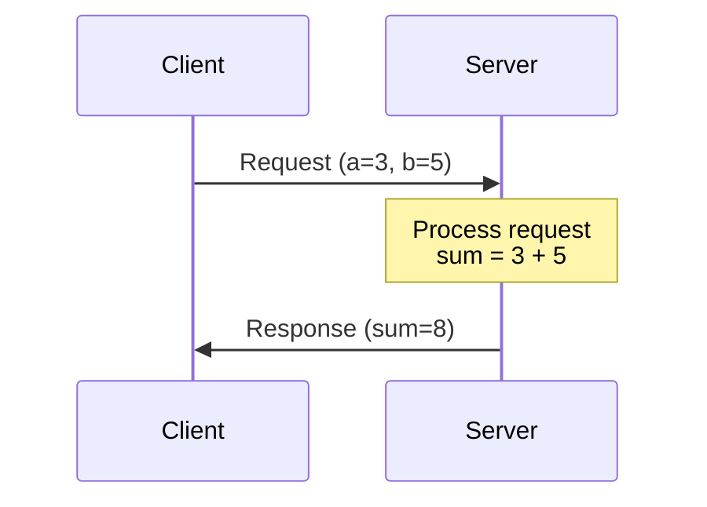
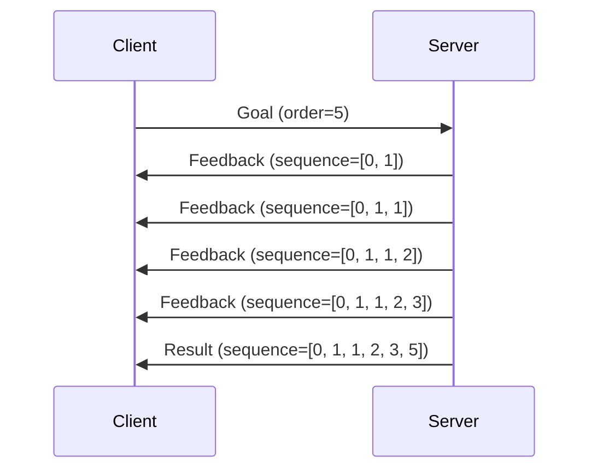

# Lesson 3: Services and Actions

Learn synchronous request-response communication with services and goal-based interactions with actions.

## Learning Objectives

- Understand when to use services vs topics
- Implement service servers and clients in Python
- Learn the action pattern for long-running tasks with feedback
- Create action servers and clients for goal-based operations
- Distinguish between topics, services, and actions

## Prerequisites

import CalloutBox from '@site/src/components/CalloutBox';

<CalloutBox type="prerequisite" title="Before You Begin">

- Completed [Lesson 2: Nodes and Topics](./02-nodes-topics.md)
- Understanding of publish-subscribe pattern
- Familiarity with callbacks in Python

</CalloutBox>

## Communication Patterns Comparison

ROS 2 provides three communication mechanisms:

| Pattern | Type | Use Case | Blocking? |
|---------|------|----------|-----------|
| **Topics** | Pub/Sub | Continuous data streams (sensor data, status) | No (async) |
| **Services** | Request/Response | One-off queries or commands (add two numbers, set parameter) | Yes (sync) |
| **Actions** | Goal-Feedback-Result | Long-running tasks with progress updates (navigate to pose, grasp object) | No (async with feedback) |

<CalloutBox type="tip" title="When to Use What">

- **Topics**: Sensor streams, robot state, continuous data
- **Services**: Quick operations, configuration, queries
- **Actions**: Navigation, manipulation, any task that takes >1 second

</CalloutBox>

## Services: Request-Response Communication

### What is a Service?

A **service** is a synchronous request-response pattern where:
1. Client sends a **request** to the server
2. Server processes the request
3. Server returns a **response** to the client



### Service Message Structure

Services use `.srv` files defining request and response fields:

**Example**: `example_interfaces/srv/AddTwoInts.srv`
```
int64 a
int64 b
---
int64 sum
```

- **Above the `---`**: Request fields
- **Below the `---`**: Response fields

## Creating a Service Server

Let's create a server that adds two integers.

**File**: `examples/add_two_ints_server.py` (see full code in [Examples](#hands-on-examples))

### Server Code Walkthrough

```python
import rclpy
from rclpy.node import Node
from example_interfaces.srv import AddTwoInts

class AddTwoIntsServer(Node):
    def __init__(self):
        super().__init__('add_two_ints_server')
        self.srv = self.create_service(
            AddTwoInts,
            'add_two_ints',
            self.add_two_ints_callback
        )
        self.get_logger().info('Add Two Ints Server Ready')

    def add_two_ints_callback(self, request, response):
        response.sum = request.a + request.b
        self.get_logger().info(f'Request: {request.a} + {request.b} = {response.sum}')
        return response

def main(args=None):
    rclpy.init(args=args)
    node = AddTwoIntsServer()
    rclpy.spin(node)
    node.destroy_node()
    rclpy.shutdown()

if __name__ == '__main__':
    main()
```

### Key Components

| Component | Explanation |
|-----------|-------------|
| `create_service(Type, Name, Callback)` | Register service with type, name, and handler |
| `request` | Contains client's input data (`a`, `b`) |
| `response` | Object to populate with result (`sum`) |
| `return response` | Send response back to client |

## Creating a Service Client

Now let's create a client that calls the service.

**File**: `examples/add_two_ints_client.py` (see full code in [Examples](#hands-on-examples))

### Client Code Walkthrough

```python
import sys
import rclpy
from rclpy.node import Node
from example_interfaces.srv import AddTwoInts

class AddTwoIntsClient(Node):
    def __init__(self):
        super().__init__('add_two_ints_client')
        self.client = self.create_client(AddTwoInts, 'add_two_ints')

        # Wait for service to be available
        while not self.client.wait_for_service(timeout_sec=1.0):
            self.get_logger().info('Service not available, waiting...')

        self.request = AddTwoInts.Request()

    def send_request(self, a, b):
        self.request.a = a
        self.request.b = b
        self.future = self.client.call_async(self.request)
        return self.future

def main(args=None):
    rclpy.init(args=args)
    node = AddTwoIntsClient()

    future = node.send_request(3, 5)
    rclpy.spin_until_future_complete(node, future)

    if future.result() is not None:
        node.get_logger().info(f'Result: {future.result().sum}')
    else:
        node.get_logger().error('Service call failed')

    node.destroy_node()
    rclpy.shutdown()

if __name__ == '__main__':
    main()
```

### Client Workflow

1. **Create client** with service type and name
2. **Wait for service** to be available (`wait_for_service()`)
3. **Send request** asynchronously (`call_async()`)
4. **Spin until complete** (`spin_until_future_complete()`)
5. **Check result** and handle response

<CalloutBox type="warning" title="Service Availability">

Always check if the service is available before calling. If the server isn't running, your client will block indefinitely.

</CalloutBox>

## Running Services

### Terminal 1: Start Server

```bash
python3 examples/add_two_ints_server.py
```

**Output**:
```
[INFO] [add_two_ints_server]: Add Two Ints Server Ready
```

### Terminal 2: Start Client

```bash
python3 examples/add_two_ints_client.py
```

**Output**:
```
[INFO] [add_two_ints_client]: Result: 8
```

### Terminal 1 (Server Logs):
```
[INFO] [add_two_ints_server]: Request: 3 + 5 = 8
```

## Inspecting Services

### List All Services

```bash
ros2 service list
```

**Output**:
```
/add_two_ints
/add_two_ints_server/describe_parameters
...
```

### Service Type

```bash
ros2 service type /add_two_ints
```

**Output**:
```
example_interfaces/srv/AddTwoInts
```

### Call Service from CLI

```bash
ros2 service call /add_two_ints example_interfaces/srv/AddTwoInts "{a: 10, b: 20}"
```

**Output**:
```
response:
  sum: 30
```

## Actions: Long-Running Goals with Feedback

### What is an Action?

An **action** is for tasks that:
- Take significant time to complete (>1 second)
- Provide progress feedback
- Can be cancelled mid-execution

**Examples**: Navigate to a goal, grasp an object, charge battery.

### Action Structure

Actions have three message types:

1. **Goal**: What you want to achieve
2. **Feedback**: Progress updates during execution
3. **Result**: Final outcome when done



## Creating an Action Server

Let's create a Fibonacci sequence generator as an action.

**File**: `examples/fibonacci_action_server.py` (see full code in [Examples](#hands-on-examples))

### Action Server Code (Simplified)

```python
import time
import rclpy
from rclpy.action import ActionServer
from rclpy.node import Node
from action_tutorials_interfaces.action import Fibonacci

class FibonacciActionServer(Node):
    def __init__(self):
        super().__init__('fibonacci_action_server')
        self._action_server = ActionServer(
            self,
            Fibonacci,
            'fibonacci',
            self.execute_callback
        )
        self.get_logger().info('Fibonacci Action Server Started')

    def execute_callback(self, goal_handle):
        self.get_logger().info('Executing goal...')

        # Initialize feedback message
        feedback_msg = Fibonacci.Feedback()
        feedback_msg.partial_sequence = [0, 1]

        # Generate Fibonacci sequence
        for i in range(1, goal_handle.request.order):
            # Publish feedback
            feedback_msg.partial_sequence.append(
                feedback_msg.partial_sequence[i] + feedback_msg.partial_sequence[i-1]
            )
            goal_handle.publish_feedback(feedback_msg)
            time.sleep(0.5)  # Simulate work

        goal_handle.succeed()

        # Return result
        result = Fibonacci.Result()
        result.sequence = feedback_msg.partial_sequence
        return result

def main(args=None):
    rclpy.init(args=args)
    node = FibonacciActionServer()
    rclpy.spin(node)
    node.destroy_node()
    rclpy.shutdown()

if __name__ == '__main__':
    main()
```

### Key Action Server Components

| Component | Purpose |
|-----------|---------|
| `ActionServer(node, Type, name, callback)` | Create action server |
| `goal_handle.request` | Access goal data (e.g., `order=5`) |
| `goal_handle.publish_feedback(msg)` | Send progress updates to client |
| `goal_handle.succeed()` | Mark goal as completed successfully |
| `return result` | Send final result to client |

## Creating an Action Client

**File**: `examples/fibonacci_action_client.py` (see full code in [Examples](#hands-on-examples))

### Action Client Code (Simplified)

```python
import rclpy
from rclpy.action import ActionClient
from rclpy.node import Node
from action_tutorials_interfaces.action import Fibonacci

class FibonacciActionClient(Node):
    def __init__(self):
        super().__init__('fibonacci_action_client')
        self._action_client = ActionClient(self, Fibonacci, 'fibonacci')

    def send_goal(self, order):
        goal_msg = Fibonacci.Goal()
        goal_msg.order = order

        self._action_client.wait_for_server()
        self._send_goal_future = self._action_client.send_goal_async(
            goal_msg,
            feedback_callback=self.feedback_callback
        )
        self._send_goal_future.add_done_callback(self.goal_response_callback)

    def feedback_callback(self, feedback_msg):
        feedback = feedback_msg.feedback
        self.get_logger().info(f'Feedback: {feedback.partial_sequence}')

    def goal_response_callback(self, future):
        goal_handle = future.result()
        if not goal_handle.accepted:
            self.get_logger().info('Goal rejected')
            return

        self.get_logger().info('Goal accepted')
        self._get_result_future = goal_handle.get_result_async()
        self._get_result_future.add_done_callback(self.get_result_callback)

    def get_result_callback(self, future):
        result = future.result().result
        self.get_logger().info(f'Result: {result.sequence}')
        rclpy.shutdown()

def main(args=None):
    rclpy.init(args=args)
    node = FibonacciActionClient()
    node.send_goal(10)
    rclpy.spin(node)

if __name__ == '__main__':
    main()
```

### Action Client Workflow

1. Create `ActionClient` with action type and name
2. **Send goal** asynchronously
3. **Handle feedback** via `feedback_callback` (progress updates)
4. **Handle goal acceptance** via `goal_response_callback`
5. **Get final result** via `get_result_callback`

## Running Actions

### Terminal 1: Start Action Server

```bash
python3 examples/fibonacci_action_server.py
```

### Terminal 2: Start Action Client

```bash
python3 examples/fibonacci_action_client.py
```

**Client Output** (with feedback):
```
[INFO] [fibonacci_action_client]: Goal accepted
[INFO] [fibonacci_action_client]: Feedback: [0, 1, 1]
[INFO] [fibonacci_action_client]: Feedback: [0, 1, 1, 2]
[INFO] [fibonacci_action_client]: Feedback: [0, 1, 1, 2, 3]
[INFO] [fibonacci_action_client]: Feedback: [0, 1, 1, 2, 3, 5]
[INFO] [fibonacci_action_client]: Result: [0, 1, 1, 2, 3, 5, 8, 13, 21, 34, 55]
```

## Inspecting Actions

### List All Actions

```bash
ros2 action list
```

### Action Information

```bash
ros2 action info /fibonacci
```

### Send Goal from CLI

```bash
ros2 action send_goal /fibonacci action_tutorials_interfaces/action/Fibonacci "{order: 5}"
```

## When to Use Each Pattern

<CalloutBox type="info" title="Decision Matrix">

| Scenario | Use This |
|----------|----------|
| Streaming sensor data (camera, lidar) | **Topic** |
| Robot velocity commands | **Topic** |
| Get current battery percentage | **Service** |
| Set robot configuration | **Service** |
| Navigate to waypoint (takes 30 seconds) | **Action** |
| Pick and place object (takes 10 seconds) | **Action** |
| Emergency stop command | **Topic** (fastest) |

</CalloutBox>

## Hands-On Examples

Full executable code is available in the `examples/` directory:

- **[add_two_ints_server.py](./examples/add_two_ints_server.py)** - Service server for adding integers
- **[add_two_ints_client.py](./examples/add_two_ints_client.py)** - Service client example
- **[fibonacci_action_server.py](./examples/fibonacci_action_server.py)** - Action server with feedback
- **[fibonacci_action_client.py](./examples/fibonacci_action_client.py)** - Action client with feedback handling

## Common Issues

import TroubleshootingBox from '@site/src/components/TroubleshootingBox';

<TroubleshootingBox
  issue="Service call hangs indefinitely"
  symptom="Client waits forever, no response"
  cause="Service server not running or service name mismatch"
  solution={`# List available services
ros2 service list

# Check if your service is there
ros2 service list | grep add_two_ints

# Ensure server is running
python3 examples/add_two_ints_server.py`}
  verification={`ros2 service call /add_two_ints example_interfaces/srv/AddTwoInts "{a: 1, b: 2}"`}
/>

<TroubleshootingBox
  issue="Action goal rejected"
  symptom="Goal not accepted by server"
  cause="Invalid goal parameters or server not ready"
  solution={`# Check action server is running
ros2 action list

# Test with CLI first
ros2 action send_goal /fibonacci action_tutorials_interfaces/action/Fibonacci "{order: 3}"`}
/>

## Summary

In this lesson, you learned:

- ✅ **Services** provide synchronous request-response communication
- ✅ **Actions** handle long-running tasks with feedback and cancellation
- ✅ Services block the client, actions don't
- ✅ Choose topics for streaming, services for queries, actions for tasks
- ✅ ROS 2 CLI tools (`ros2 service`, `ros2 action`) help debug interactions

## Next Steps

Now that you understand all three ROS 2 communication patterns, let's learn how to **model robot structures** using URDF (Unified Robot Description Format).

Continue to [Lesson 4: URDF Modeling](./04-urdf-modeling.md) →

## Additional Resources

- [ROS 2 Understanding Services](https://docs.ros.org/en/humble/Tutorials/Beginner-CLI-Tools/Understanding-ROS2-Services/Understanding-ROS2-Services.html)
- [ROS 2 Understanding Actions](https://docs.ros.org/en/humble/Tutorials/Beginner-CLI-Tools/Understanding-ROS2-Actions/Understanding-ROS2-Actions.html)
- [Writing an Action Server and Client (Python)](https://docs.ros.org/en/humble/Tutorials/Intermediate/Writing-an-Action-Server-Client/Py.html)
