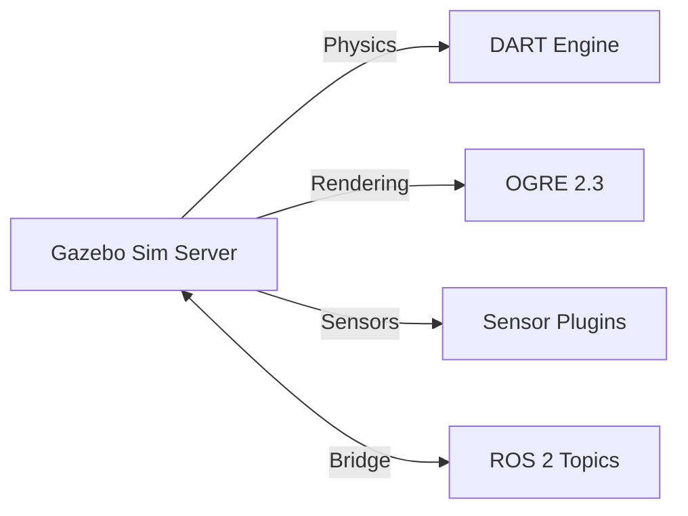

# Lesson 2: Gazebo Garden Setup

Learn how to install Gazebo Garden and integrate it with ROS 2 Humble for physics-based robot simulation.

## Learning Objectives

- Install Gazebo Garden on Ubuntu 22.04
- Configure the ros_gz bridge for ROS 2 integration
- Launch your first Gazebo simulation
- Understand Gazebo's architecture and key components

## Prerequisites

import CalloutBox from '@site/src/components/CalloutBox';

<CalloutBox type="prerequisite" title="Before You Begin">

- Ubuntu 22.04 LTS with ROS 2 Humble installed (Module 1)
- 8GB+ RAM recommended
- GPU recommended (Intel/NVIDIA/AMD)
- Stable internet connection for package downloads

</CalloutBox>

## Why Gazebo Garden?

**Gazebo Garden** (formerly Ignition Gazebo) is the successor to Gazebo Classic. It offers:

- **Modern architecture**: Plugin-based, modular design
- **Better physics**: DART and Bullet engines with GPU acceleration
- **Improved sensors**: Realistic camera, lidar, IMU models
- **ROS 2 native**: Tight integration via ros_gz bridge
- **Distributed simulation**: Run physics, rendering, and sensors separately

Gazebo Classic is deprecated. Garden is the recommended version for new projects.

## Installation Steps

### Step 1: Add Gazebo Garden Repository

```bash
# Install prerequisites
sudo apt-get update
sudo apt-get install lsb-release wget gnupg -y

# Add Gazebo GPG key
sudo wget https://packages.osrfoundation.org/gazebo.gpg -O /usr/share/keyrings/pkgs-osrf-archive-keyring.gpg

# Add repository to sources
echo "deb [arch=$(dpkg --print-architecture) signed-by=/usr/share/keyrings/pkgs-osrf-archive-keyring.gpg] http://packages.osrfoundation.org/gazebo/ubuntu-stable $(lsb_release -cs) main" | sudo tee /etc/apt/sources.list.d/gazebo-stable.list > /dev/null
```

### Step 2: Install Gazebo Garden

```bash
sudo apt-get update
sudo apt-get install gz-garden -y
```

**Installation size**: ~800MB  
**Installation time**: 5-10 minutes

### Step 3: Install ROS 2 - Gazebo Bridge

The `ros_gz` package provides bidirectional communication between ROS 2 and Gazebo:

```bash
sudo apt install ros-humble-ros-gz -y
```

This installs:
- `ros_gz_bridge`: Message translation (ROS topics ↔ Gazebo topics)
- `ros_gz_sim`: Launch Gazebo from ROS 2
- `ros_gz_image`: Image transport optimization

### Step 4: Verify Installation

Check Gazebo version:

```bash
gz sim --version
# Expected output: Gazebo Sim, version 7.x.x
```

## Understanding Gazebo Architecture

Gazebo Garden uses a **distributed architecture**:



**Key components**:
- **gz sim**: Main simulation server (physics + logic)
- **gz gui**: Graphical interface (can run separately)
- **Plugins**: Sensors, actuators, world behaviors
- **SDF**: Simulation Description Format (XML-based world files)

## Launching Your First Simulation

### Test with Built-in World

Launch a demo world:

```bash
gz sim shapes.sdf
```

You should see:
- 3D viewport with geometric shapes
- Physics simulation (objects fall with gravity)
- Camera controls (drag to rotate, scroll to zoom)

**Controls**:
- **Left-click + drag**: Rotate camera
- **Middle-click + drag**: Pan camera
- **Scroll wheel**: Zoom in/out
- **Right-click**: Select objects

### Launch with ROS 2 Integration

Start Gazebo with ROS 2 bridge:

```bash
# Terminal 1: Launch Gazebo
ros2 launch ros_gz_sim gz_sim.launch.py gz_args:="shapes.sdf"

# Terminal 2: List ROS topics (wait for Gazebo to start)
ros2 topic list
```

You should see topics like:
- `/clock` - Simulation time
- `/parameter_events` - ROS 2 parameter changes
- `/rosout` - ROS 2 logging

<CalloutBox type="info" title="Gazebo Time vs Real Time">

Gazebo runs its own clock (simulation time) which may differ from wall-clock time. The `/clock` topic publishes simulation time for ROS 2 nodes.

</CalloutBox>

## Exploring the Gazebo GUI

The Gazebo interface includes several panels:

| Panel | Purpose |
|-------|---------|
| **3D Scene** | Main viewport for visualization |
| **Entity Tree** | Hierarchical list of world objects |
| **Component Inspector** | Properties of selected entities |
| **Plugin Manager** | Load/unload Gazebo plugins |
| **Transport Topics** | View Gazebo internal topics |

**Useful plugins** (Window menu → Add plugins):
- **World Control**: Play/pause simulation
- **Scene 3D**: Adjust rendering settings
- **Entity Tree**: Navigate world objects
- **Component Inspector**: Modify entity properties

## ROS 2 - Gazebo Bridge Configuration

The bridge translates messages between ROS 2 and Gazebo:

**Example bridge configuration** (`bridge.yaml`):

```yaml
# ROS 2 topic → Gazebo topic
- ros_topic_name: "/cmd_vel"
  gz_topic_name: "/model/robot/cmd_vel"
  ros_type_name: "geometry_msgs/msg/Twist"
  gz_type_name: "gz.msgs.Twist"
  direction: ROS_TO_GZ

# Gazebo topic → ROS 2 topic
- ros_topic_name: "/camera/image"
  gz_topic_name: "/camera"
  ros_type_name: "sensor_msgs/msg/Image"
  gz_type_name: "gz.msgs.Image"
  direction: GZ_TO_ROS
```

Launch bridge with config:

```bash
ros2 run ros_gz_bridge parameter_bridge --ros-args -p config_file:=bridge.yaml
```

## Common Issues and Solutions

import TroubleshootingBox from '@site/src/components/TroubleshootingBox';

<TroubleshootingBox
  issue="gz: command not found"
  symptom="Shell doesn't recognize gz commands"
  cause="Gazebo Garden not properly installed or not in PATH"
  solution="sudo apt-get install gz-garden && source ~/.bashrc"
  verification="gz sim --version"
/>

<TroubleshootingBox
  issue="Black screen or rendering errors"
  symptom="Gazebo GUI shows black viewport or crashes"
  cause="Graphics driver issues or insufficient GPU"
  solution="Update GPU drivers: sudo ubuntu-drivers autoinstall (NVIDIA) or run with software rendering: LIBGL_ALWAYS_SOFTWARE=1 gz sim shapes.sdf"
  verification="gz sim shapes.sdf loads with visible shapes"
/>

<TroubleshootingBox
  issue="ros_gz packages not found"
  symptom="E: Unable to locate package ros-humble-ros-gz"
  cause="ROS 2 repositories not up to date"
  solution="sudo apt update && sudo apt install ros-humble-ros-gz"
  verification="ros2 pkg list | grep ros_gz"
/>

## Summary

You now have Gazebo Garden installed and integrated with ROS 2:
- Installed Gazebo Garden simulation environment
- Set up ros_gz bridge for ROS 2 communication
- Launched and explored the Gazebo GUI
- Understood Gazebo's distributed architecture

In the next lesson, you'll learn about **physics simulation** - gravity, collisions, friction, and sensor plugins.

## Additional Resources

- [Gazebo Garden Documentation](https://gazebosim.org/docs/garden)
- [ros_gz GitHub Repository](https://github.com/gazebosim/ros_gz)
- [SDF Format Specification](http://sdformat.org/)
- [Gazebo Tutorials](https://gazebosim.org/docs/garden/tutorials)
