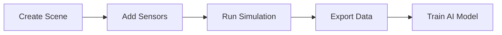

# Lesson 2: Synthetic Data Generation

## Why Synthetic Data?

- **No manual labeling** - automatically annotated
- **Infinite variety** - generate thousands of scenarios
- **Perfect ground truth** - depth, segmentation, pose
- **Train perception models** before real-world deployment

## Isaac Sim Synthetic Data Pipeline



## Create Photorealistic Scene

**Built-in assets:**
1. Isaac Sim → Create → Environment
2. Select "Hospital" or "Warehouse"
3. Add furniture from Asset Browser

**Custom props:**
- Drag .USD/.USDA files into scene
- Apply materials (Glass, Metal, Wood)
- Use Replicator for randomization

## Add RGB-D Camera

**Standalone Python API:**
```python
from omni.isaac.core.utils.prims import create_prim
from omni.isaac.sensor import Camera

camera = Camera("/World/Camera", resolution=(640, 480))
camera.initialize()

# Enable depth output
camera.add_depth_data_to_frame()
```

See `examples/create_indoor_scene.py` for full script.

## Export Dataset

**Replicator Writer for batch export:**
- RGB images (PNG)
- Depth maps (NPY/EXR)
- Semantic segmentation
- Bounding boxes (COCO format)
- Camera intrinsics

```python
import omni.replicator.core as rep

rp = rep.create.render_product("/World/Camera", (640, 480))
writer = rep.WriterRegistry.get("BasicWriter")
writer.initialize(output_dir="dataset/", rgb=True, depth=True)
writer.attach(rp)
```

## Lidar Point Clouds

Isaac Sim supports rotating lidar sensors:

- Velodyne VLP-16 (16 beams)
- Ouster OS1-64 (64 beams)
- Custom LIDAR configurations

**Export formats:**
- PCD (Point Cloud Data)
- LAS (Lidar Exchange Format)

## Domain Randomization

Improve sim-to-real transfer:

- **Lighting**: Random HDR environments
- **Textures**: Randomize materials
- **Objects**: Randomize poses, scales
- **Sensor noise**: Add Gaussian noise

```python
with rep.trigger.on_frame():
    rep.randomizer.color(colors=rep.distribution.uniform((0,0,0), (1,1,1)))
    rep.randomizer.rotation(rotation=rep.distribution.uniform((0,0,0), (360,360,360)))
```

## Next Lesson

Lesson 3: Use this synthetic data to train VSLAM and perception models.
