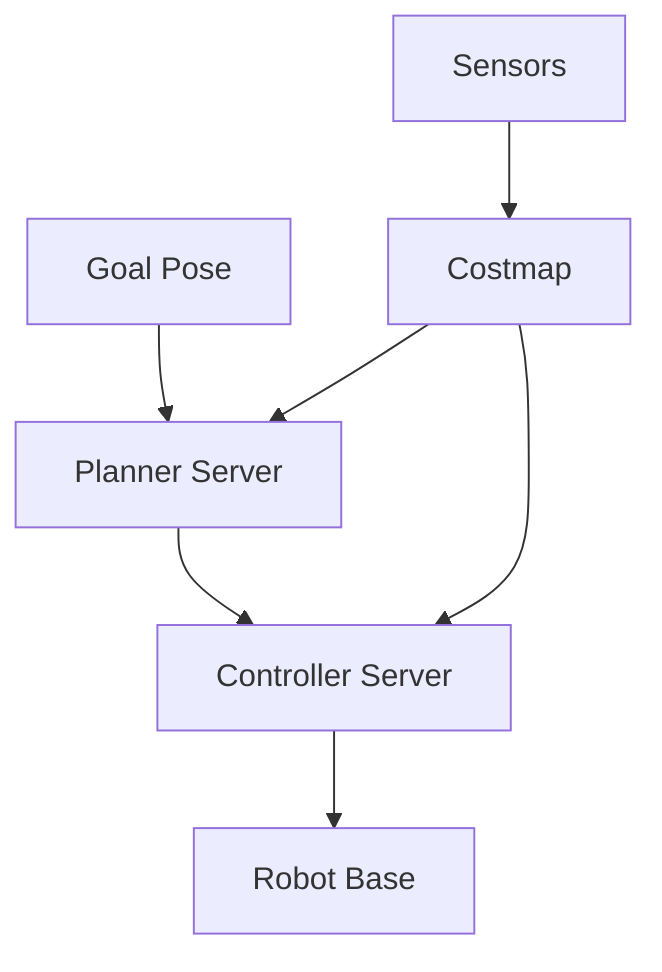

# Lesson 4: Autonomous Navigation with Nav2

## Nav2 Stack Overview

**ROS 2 Navigation Stack (Nav2):**
- Path planning (A*, Theta*)
- Obstacle avoidance
- Dynamic re-planning
- Recovery behaviors

## Architecture



**Key nodes:**
- **Planner**: Compute global path
- **Controller**: Generate velocity commands
- **Costmap**: Build obstacle map from sensors
- **Recovery**: Handle stuck situations

## Installation

```bash
sudo apt install ros-humble-navigation2 ros-humble-nav2-bringup
```

## Configuration for Humanoid

Nav2 expects differential drive by default. For bipedal robots:

**Edit `nav2_params.yaml`:**
```yaml
robot_base_frame: base_link
footprint: [[0.3, 0.2], [0.3, -0.2], [-0.3, -0.2], [-0.3, 0.2]]

controller_server:
  FollowPath:
    max_vel_x: 0.5  # Walking speed
    max_vel_theta: 1.0
    acc_lim_x: 0.3  # Conservative acceleration
```

See `examples/nav2_params.yaml` for full config.

## Launch Nav2

```bash
# Terminal 1: Isaac Sim with VSLAM running
# Terminal 2: Launch Nav2
ros2 launch nav2_bringup navigation_launch.py \
  params_file:=nav2_params.yaml \
  use_sim_time:=True

# Terminal 3: RViz2
ros2 launch nav2_bringup rviz_launch.py
```

## Send Navigation Goal

**Option 1: RViz2**
- Click "2D Goal Pose" button
- Click/drag on map to set goal

**Option 2: Python script**
```python
from nav2_simple_commander.robot_navigator import BasicNavigator

nav = BasicNavigator()
goal_pose = {'position': {'x': 5.0, 'y': 3.0}, 'orientation': {'w': 1.0}}
nav.goToPose(goal_pose)
```

See `examples/send_nav_goal.py` for waypoint sequences.

## Costmap Configuration

**Global Costmap** (static map):
- Uses VSLAM map
- Updates slowly

**Local Costmap** (dynamic obstacles):
- Uses lidar/depth camera
- Updates at 5 Hz
- Radius: 3-5 meters

```yaml
local_costmap:
  update_frequency: 5.0
  width: 6
  height: 6
  resolution: 0.05
```

## Bipedal Locomotion Challenges

**Unlike wheeled robots:**
- Cannot turn in place (need forward motion)
- Slower velocity
- Higher center of gravity (stability)

**Solutions:**
- Increase `min_turning_radius` in planner
- Lower `max_vel_x` to 0.5 m/s
- Enable `allow_reversing: false`

## Testing Workflow

1. **Create map** with VSLAM (Lesson 3)
2. **Save map**: `ros2 service call /map_saver/save_map nav2_msgs/srv/SaveMap`
3. **Launch Nav2** with saved map
4. **Set goal** in RViz2
5. **Monitor** robot navigation

## Common Issues

| Problem | Fix |
|---------|-----|
| Robot stuck | Tune recovery behaviors |
| Collisions | Increase inflation radius |
| Jagged paths | Use Theta* planner instead of A* |

## Next Steps

Module 4: Add vision-language-action control for natural language commands.
