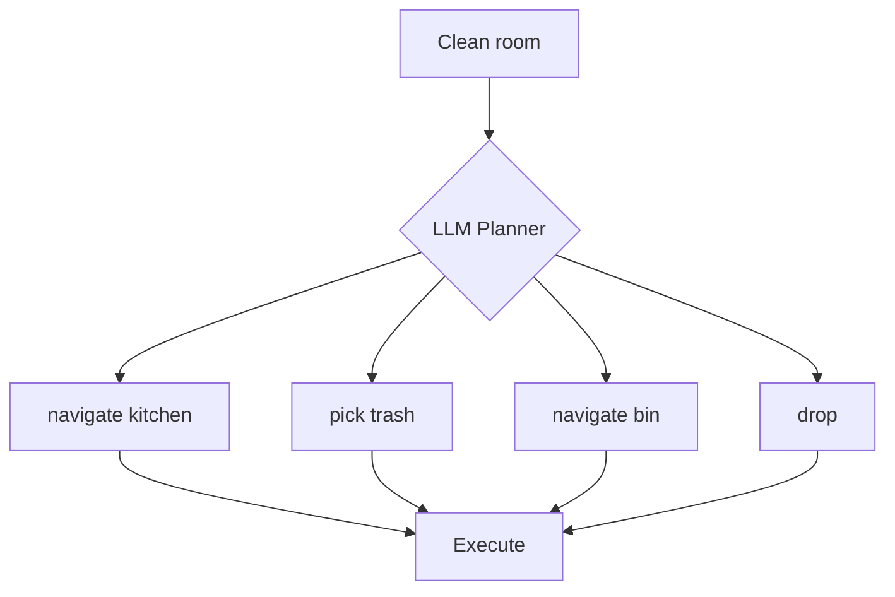

# Lesson 2: LLM Task Planning

## LLM for Robotics

Use Large Language Models to decompose natural language commands into robot actions.

**Example:**
- Input: "Clean the kitchen"
- Output: [navigate(kitchen), detect_objects(), pick(trash), navigate(bin), drop()]

## Options

| Method | Pros | Cons |
|--------|------|------|
| OpenAI API | Best quality, fast | Requires API key, costs money |
| Local Llama | Free, private | Slower, needs powerful GPU |

## OpenAI API Setup

```bash
pip install openai
export OPENAI_API_KEY="sk-..."
```

**Basic usage:**
```python
from openai import OpenAI

client = OpenAI()
response = client.chat.completions.create(
    model="gpt-4",
    messages=[{"role": "user", "content": "Navigate to the kitchen"}]
)
print(response.choices[0].message.content)
```

## Task Decomposition

**System prompt (task_planner_prompt.txt):**
```
You are a robot task planner. Convert natural language commands into JSON action sequences.

Available actions:
- navigate(location: str)
- pick(object: str)
- place(location: str)
- wait(seconds: int)

Example:
Input: "Bring me the book from the table"
Output: {"actions": ["navigate(table)", "pick(book)", "navigate(user)", "place(user)"]}
```

## Task Decomposition Flow



## Prompt Engineering Tips

**Be specific:**
- ✓ "Navigate to kitchen and pick up red cup"
- ✗ "Get the thing over there"

**Provide context:**
```python
prompt = f"""
Robot state:
- Location: {current_location}
- Battery: {battery_level}%
- Holding: {held_object or "nothing"}

User command: {user_command}

Generate action sequence:
"""
```

**Constrain output format:**
```python
prompt += """
Output ONLY valid JSON with this schema:
{
  "actions": ["action1(arg)", "action2(arg)"],
  "estimated_time": 120
}
"""
```

## Local Llama Alternative

**For privacy/offline:**
```bash
pip install llama-cpp-python
wget https://huggingface.co/TheBloke/Llama-2-7B-Chat-GGUF
```

```python
from llama_cpp import Llama

llm = Llama(model_path="llama-2-7b-chat.gguf")
response = llm("Navigate to kitchen", max_tokens=100)
```

Slower but runs locally.

## Error Handling

LLM may generate invalid actions:

```python
def validate_action(action):
    valid_actions = ["navigate", "pick", "place", "wait"]
    action_name = action.split("(")[0]
    return action_name in valid_actions
```

## Next Lesson

Execute LLM-generated action sequences with ROS 2.
