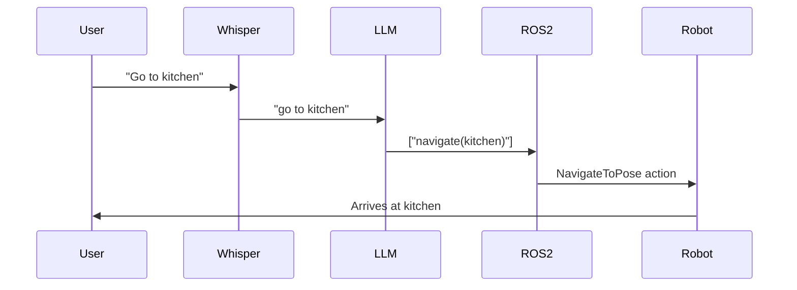

# Lesson 4: Capstone Project - Full VLA Pipeline

## End-to-End System

Integrate all modules into working voice-controlled robot.

## VLA Pipeline Architecture



## Launch Full Stack

See `examples/capstone_demo.launch.py`:

```bash
ros2 launch vla_demos capstone_demo.launch.py
```

**Starts:**
1. Gazebo with test environment
2. VSLAM for localization
3. Nav2 for navigation
4. Whisper ROS node
5. LLM planner node
6. Action orchestrator

## Demo Scenarios

### Scenario 1: Navigation
```
User: "Robot, go to the kitchen"
→ Whisper: "robot go to the kitchen"
→ LLM: {"actions": ["navigate(kitchen)"]}
→ Nav2: Navigates to kitchen coordinates
→ Robot: Arrives and reports "Arrived at kitchen"
```

### Scenario 2: Object Retrieval
```
User: "Bring me the cup from the table"
→ LLM: {"actions": [
    "navigate(table)",
    "pick(cup)",
    "navigate(user)",
    "place(user)"
]}
→ Robot: Executes sequence
```

### Scenario 3: Multi-Step Task
```
User: "Clean the living room"
→ LLM: {"actions": [
    "navigate(living_room)",
    "detect_objects()",
    "pick(trash)",
    "navigate(bin)",
    "drop()",
    "navigate(living_room)",
    "speak('Cleaning complete')"
]}
```

## Testing Checklist

- [ ] Whisper transcribes voice commands accurately
- [ ] LLM generates valid action sequences
- [ ] Nav2 navigates to requested locations
- [ ] Error handling gracefully recovers
- [ ] Feedback messages informative
- [ ] End-to-end latency &lt;5 seconds

## Performance Metrics

**Target benchmarks:**
- Voice→Action latency: &lt;3s
- Navigation success rate: >90%
- LLM action validity: >95%
- System uptime: >60 minutes

## Common Issues

| Issue | Solution |
|-------|----------|
| Whisper misunderstands | Use push-to-talk, reduce background noise |
| LLM hallucinates actions | Improve system prompt, add validation |
| Navigation fails | Check map quality, tune Nav2 params |

## Extensions

**Advanced features:**
- Vision grounding (point at object: "Pick up that")
- Context memory (remember previous commands)
- Multi-robot coordination
- Adaptive learning from feedback

## Hackathon Tips

**3-hour sprint:**
1. Hour 1: Get basic navigation working
2. Hour 2: Add Whisper + LLM
3. Hour 3: Test scenarios, handle errors

**Debugging:**
- Use `ros2 topic echo` to monitor all topics
- Add verbose logging: `RCUTILS_CONSOLE_OUTPUT_FORMAT="[{severity}] [{name}]: {message}"`
- Test components individually before integration

## Deployment

**On real hardware:**
1. Replace Gazebo with real sensors
2. Add safety limits (max velocity, geofencing)
3. Implement emergency stop
4. Test in controlled environment first

## Next Steps

Module 5: Deploy on real humanoid robot hardware.
