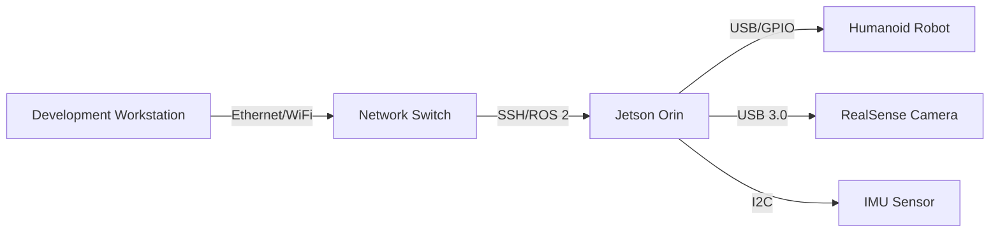

# Lesson 1: Development Workstation

Build a workstation capable of running Isaac Sim, ROS 2, and AI models.

## Minimum Specifications

| Component | Minimum | Recommended |
|-----------|---------|-------------|
| **GPU** | RTX 3060 (12GB VRAM) | RTX 4070 (12GB+) |
| **CPU** | Intel i7-12700 / Ryzen 7 5800X | i9-13900K / Ryzen 9 7950X |
| **RAM** | 32GB DDR4 | 64GB DDR5 |
| **Storage** | 512GB NVMe SSD | 1TB+ NVMe SSD |
| **OS** | Ubuntu 22.04 LTS | Ubuntu 22.04 LTS |

## Why These Specs?

- **RTX GPU**: Required for Isaac Sim raytracing and GPU-accelerated ROS nodes
- **32GB+ RAM**: Isaac Sim + Gazebo + AI models need significant memory
- **Ubuntu 22.04**: ROS 2 Humble's officially supported platform

## Hardware Architecture



## Installation Steps

**1. Install Ubuntu 22.04**
```bash
# Download from ubuntu.com/download/desktop
# Create bootable USB with Rufus (Windows) or dd (Linux)
# Install with "Erase disk" option
```

**2. Install NVIDIA Drivers**
```bash
sudo ubuntu-drivers autoinstall
sudo reboot
nvidia-smi  # Verify driver installed
```

**3. Verify GPU Performance**
```bash
# Install CUDA toolkit
wget https://developer.download.nvidia.com/compute/cuda/repos/ubuntu2204/x86_64/cuda-keyring_1.1-1_all.deb
sudo dpkg -i cuda-keyring_1.1-1_all.deb
sudo apt update
sudo apt install cuda-toolkit-12-3

# Test with nvidia-smi
nvidia-smi --query-gpu=name,memory.total,driver_version --format=csv
```

## Troubleshooting

| Issue | Solution |
|-------|----------|
| Black screen after driver install | Boot with `nomodeset`, reinstall drivers |
| `nvidia-smi` not found | Reboot, check `/usr/bin/nvidia-smi` exists |
| Low GPU memory | Close Chrome/browsers, use lightweight desktop |

## Cost Breakdown

- Workstation (DIY build): $1,500-$2,500
- Pre-built workstation: $2,000-$3,500
- Used RTX 3060 workstation: $800-$1,200

## Next Steps

Lesson 2: Set up NVIDIA Jetson for edge deployment.
