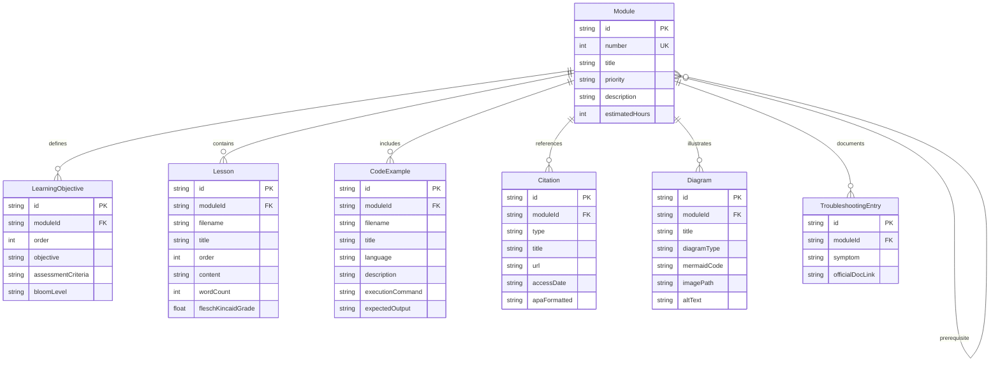

# Data Model: Physical AI & Humanoid Robotics E-Book

**Phase**: 1 - Design & Contracts
**Date**: 2025-12-13
**Purpose**: Define entities, relationships, validation rules for e-book content structure

## Entity Definitions

### 1. Module

Represents a chapter/learning unit in the e-book covering a cohesive set of robotics concepts.

**Attributes**:
- `id` (string, required): Unique identifier (e.g., "module-01-ros2", "module-02-simulation")
- `number` (integer, required): Sequential number (1-5)
- `title` (string, required): Human-readable name (e.g., "ROS 2 Foundation", "Gazebo & Unity Simulation")
- `priority` (string, required): User story priority from spec (P1, P2, P3, P4, P5)
- `description` (string, required): Brief overview (1-2 sentences, grade 9-12 reading level)
- `learningObjectives` (array of LearningObjective, required): What learner will achieve
- `prerequisites` (array of Module references, optional): Required prior modules (empty for P1/Module 1)
- `estimatedHours` (integer, required): Time to complete (4-12 hours based on spec success criteria)
- `lessons` (array of Lesson, required): Individual lesson files within module
- `codeExamples` (array of CodeExample, required): Hands-on code snippets
- `diagrams` (array of Diagram, optional): Mermaid diagrams, architecture visuals
- `citations` (array of Citation, required): APA-formatted sources (min 10 official + 5 technical)
- `troubleshooting` (array of TroubleshootingEntry, optional): Common errors and solutions

**Relationships**:
- Module → LearningObjective (1:many): A module has multiple learning objectives
- Module → Lesson (1:many): A module contains multiple lesson files
- Module → CodeExample (1:many): A module includes multiple code examples
- Module → Citation (1:many): A module references multiple sources
- Module → Module (prerequisite): Modules can depend on prior modules

**Validation Rules**:
- `number` must be unique across all modules (1-5)
- `id` must match pattern `module-{number:02d}-{slug}` (e.g., "module-01-ros2")
- `learningObjectives` must have at least 3 entries
- `citations` must have at least 15 total (10 official + 5 technical)
- `estimatedHours` must match spec success criteria (Module 1: 4-6, Module 2: 6-8, Module 3: 8-10, Module 4: 10-12)
- `description` must pass Flesch-Kincaid grade 9-12 readability test

**File Mapping**:
- Frontmatter in `my-website/docs/{module-id}/index.md`
- Lessons in `my-website/docs/{module-id}/*.md`
- Examples in `my-website/docs/{module-id}/examples/`
- Citations in `my-website/docs/{module-id}/sources.md`

---

### 2. LearningObjective

A measurable outcome defining what learner should be able to do after completing a module.

**Attributes**:
- `id` (string, required): Unique identifier (e.g., "lo-ros2-01", "lo-sim-03")
- `moduleId` (string, required): Parent module reference
- `order` (integer, required): Display sequence (1-N)
- `objective` (string, required): Action-oriented statement (e.g., "Install ROS 2 Humble on Ubuntu 22.04 without errors")
- `assessmentCriteria` (string, required): How to verify achievement (e.g., "Run ros2 topic list and see /rosout topic")
- `bloomLevel` (string, required): Cognitive level (Remember, Understand, Apply, Analyze, Evaluate, Create)

**Relationships**:
- LearningObjective → Module (many:1): Belongs to one module

**Validation Rules**:
- `objective` must start with action verb (Install, Create, Configure, Run, Implement, etc.)
- `assessmentCriteria` must be testable/measurable
- `bloomLevel` should progress from lower (Remember) in early modules to higher (Create) in later modules

**Example**:
```json
{
  "id": "lo-ros2-02",
  "moduleId": "module-01-ros2",
  "order": 2,
  "objective": "Create a ROS 2 publisher node that sends string messages to /chatter topic",
  "assessmentCriteria": "Run node, use 'ros2 topic echo /chatter' to verify messages received",
  "bloomLevel": "Apply"
}
```

---

### 3. Lesson

An individual content file (Markdown/MDX) within a module covering a specific subtopic.

**Attributes**:
- `id` (string, required): Unique identifier (e.g., "lesson-ros2-installation")
- `moduleId` (string, required): Parent module reference
- `filename` (string, required): File path relative to module dir (e.g., "01-installation.md")
- `title` (string, required): Lesson heading (e.g., "ROS 2 Humble Installation")
- `order` (integer, required): Sequence within module (1-N)
- `content` (string, required): Markdown/MDX body text
- `wordCount` (integer, required): For readability tracking
- `fleschKincaidGrade` (number, optional): Automated readability score (target 9-12)

**Relationships**:
- Lesson → Module (many:1): Belongs to one module
- Lesson → CodeExample (1:many): May reference code examples

**Validation Rules**:
- `filename` must match pattern `{order:02d}-{slug}.md` (e.g., "01-installation.md")
- `fleschKincaidGrade` must be between 9 and 12 (constitution requirement)
- `content` must include at least one heading level 2 (##)
- Internal links must resolve to existing lessons or modules

**File Mapping**:
- Stored as `my-website/docs/{moduleId}/{filename}`

---

### 4. CodeExample

A standalone, reproducible code snippet or script demonstrating a robotics concept.

**Attributes**:
- `id` (string, required): Unique identifier (e.g., "example-publisher-py")
- `moduleId` (string, required): Parent module reference
- `filename` (string, required): File path relative to examples/ (e.g., "publisher.py", "humanoid.urdf")
- `title` (string, required): Descriptive name (e.g., "Simple ROS 2 Publisher")
- `language` (string, required): Programming/markup language (python, cpp, xml, yaml, bash)
- `description` (string, required): What this example demonstrates (1-2 sentences)
- `prerequisites` (array of string, required): Dependencies to install (e.g., ["ros-humble-rclpy", "python3-pip"])
- `setupCommands` (array of string, required): Bash commands to run before execution
- `executionCommand` (string, required): Command to run the example
- `expectedOutput` (string, required): What learner should see (terminal output or screenshot path)
- `codeContent` (string, required): Full source code
- `testedOn` (string, required): Platform verification (e.g., "Ubuntu 22.04 LTS, ROS 2 Humble")

**Relationships**:
- CodeExample → Module (many:1): Belongs to one module

**Validation Rules**:
- `prerequisites` must include exact package names (e.g., "ros-humble-rclpy" not "rclpy")
- `setupCommands` must be idempotent (safe to run multiple times)
- `executionCommand` must not require interactive input
- `expectedOutput` must not contain placeholder text like "[YOUR OUTPUT HERE]"
- `language` must be recognized by Docusaurus syntax highlighter (python, cpp, bash, xml, yaml, json, typescript, c#)

**Example**:
```json
{
  "id": "example-publisher-py",
  "moduleId": "module-01-ros2",
  "filename": "publisher.py",
  "title": "Simple ROS 2 Publisher (Python)",
  "language": "python",
  "description": "Publishes string messages to /chatter topic at 1 Hz using rclpy",
  "prerequisites": ["ros-humble-rclpy", "python3"],
  "setupCommands": [
    "source /opt/ros/humble/setup.bash",
    "mkdir -p ~/ros2_ws/src/examples",
    "cd ~/ros2_ws/src/examples"
  ],
  "executionCommand": "python3 publisher.py",
  "expectedOutput": "Publishing: 'Hello World: 0'\\nPublishing: 'Hello World: 1'\\n...",
  "codeContent": "import rclpy\\nfrom rclpy.node import Node\\n...",
  "testedOn": "Ubuntu 22.04 LTS, ROS 2 Humble, Python 3.10"
}
```

---

### 5. Citation

An APA-formatted reference to official documentation, research paper, or technical source.

**Attributes**:
- `id` (string, required): Unique identifier (e.g., "cite-ros2-docs-humble")
- `moduleId` (string, required): Parent module reference
- `type` (string, required): Source category ("official", "technical", "research")
- `authors` (array of string, required): Author names or "Organization Name" for docs
- `year` (integer, required): Publication year
- `title` (string, required): Document/article title
- `url` (string, required): Permanent link (version-specific when possible)
- `accessDate` (string, required): ISO 8601 date when retrieved (YYYY-MM-DD)
- `apaFormatted` (string, required): Full APA 7th edition citation

**Relationships**:
- Citation → Module (many:1): Belongs to one module

**Validation Rules**:
- `type` must be "official", "technical", or "research"
- Module must have at least 10 citations with `type="official"`
- Module must have at least 5 citations with `type="technical"` or `type="research"`
- `url` must be HTTPS (except for DOIs)
- `apaFormatted` must follow APA 7th edition format

**Example**:
```json
{
  "id": "cite-ros2-humble-concepts",
  "moduleId": "module-01-ros2",
  "type": "official",
  "authors": ["Open Robotics"],
  "year": 2023,
  "title": "ROS 2 Humble Concepts - Nodes",
  "url": "https://docs.ros.org/en/humble/Concepts/Basic/About-Nodes.html",
  "accessDate": "2025-12-13",
  "apaFormatted": "Open Robotics. (2023). ROS 2 Humble Concepts - Nodes. https://docs.ros.org/en/humble/Concepts/Basic/About-Nodes.html"
}
```

---

### 6. Diagram

A Mermaid.js diagram or static image visualizing architecture, data flow, or system interactions.

**Attributes**:
- `id` (string, required): Unique identifier (e.g., "diagram-ros2-architecture")
- `moduleId` (string, required): Parent module reference
- `filename` (string, required): File path (Mermaid in markdown, images in static/)
- `title` (string, required): Caption for diagram
- `diagramType` (string, required): Type ("mermaid-flowchart", "mermaid-sequence", "mermaid-class", "image-png", "image-svg")
- `mermaidCode` (string, optional): Mermaid syntax (if type starts with "mermaid-")
- `imagePath` (string, optional): Relative path to static file (if type starts with "image-")
- `altText` (string, required): Accessibility description

**Validation Rules**:
- Either `mermaidCode` XOR `imagePath` must be provided (not both)
- `mermaidCode` must be valid Mermaid syntax (validated via Mermaid CLI)
- `imagePath` must exist in `my-website/static/diagrams/`
- `altText` must describe diagram for screen readers (accessibility requirement)

**Example**:
```json
{
  "id": "diagram-ros2-pub-sub",
  "moduleId": "module-01-ros2",
  "filename": "embedded-in-lesson",
  "title": "ROS 2 Publisher-Subscriber Pattern",
  "diagramType": "mermaid-flowchart",
  "mermaidCode": "flowchart LR\\n  Publisher --> Topic\\n  Topic --> Subscriber\\n",
  "altText": "Flowchart showing Publisher node sending messages to Topic, which delivers to Subscriber node"
}
```

---

### 7. TroubleshootingEntry

Documents a common error or edge case with diagnostic steps and solutions.

**Attributes**:
- `id` (string, required): Unique identifier (e.g., "troubleshoot-ros2-source-setup")
- `moduleId` (string, required): Parent module reference
- `symptom` (string, required): Error message or observable problem (e.g., "Command 'ros2' not found")
- `causes` (array of string, required): Possible root causes
- `diagnostics` (array of string, required): Steps to identify cause
- `solutions` (array of string, required): Fixes to apply
- `officialDocLink` (string, optional): Link to official troubleshooting guide if available

**Validation Rules**:
- `symptom` must be specific (not vague like "it doesn't work")
- `solutions` must include exact commands or configuration changes
- `officialDocLink` if provided must link to official documentation

**Example**:
```json
{
  "id": "troubleshoot-ros2-setup-bash",
  "moduleId": "module-01-ros2",
  "symptom": "Terminal shows 'ros2: command not found' after installation",
  "causes": [
    "ROS 2 environment not sourced in current shell",
    "Incorrect installation path",
    "Shell configuration not updated"
  ],
  "diagnostics": [
    "Check if /opt/ros/humble/setup.bash exists",
    "Run 'echo $ROS_DISTRO' - should show 'humble'",
    "Verify installation with 'dpkg -l | grep ros-humble'"
  ],
  "solutions": [
    "Run 'source /opt/ros/humble/setup.bash' in current terminal",
    "Add 'source /opt/ros/humble/setup.bash' to ~/.bashrc for persistence",
    "Restart terminal or run 'source ~/.bashrc'"
  ],
  "officialDocLink": "https://docs.ros.org/en/humble/Tutorials/Beginner-CLI-Tools/Configuring-ROS2-Environment.html"
}
```

---

## Entity Relationships Diagram



---

## Validation Summary

**Module-Level Checks**:
1. Each module has 3+ learning objectives
2. Each module has 10+ official + 5+ technical citations
3. Each module has estimated hours matching spec (4-12 hours)
4. Module prerequisites form valid dependency chain (no cycles)

**Content Quality Checks**:
1. All lessons pass Flesch-Kincaid 9-12 readability test
2. All code examples tested on Ubuntu 22.04 (testedOn field required)
3. All citations follow APA 7th edition format
4. All diagrams have accessibility alt text

**Build Validation**:
1. Docusaurus build completes with 0 errors, 0 warnings
2. All internal links resolve (module cross-references, lesson links)
3. All external links return HTTP 200 (official docs, citations)
4. All Mermaid diagrams render without syntax errors

**Constitution Compliance**:
1. Verified Information Only: All code examples tested, citations to official docs
2. Build-First Verification: Docusaurus build required before merging
3. Clear Writing: Flesch-Kincaid 9-12 enforced on all lessons
4. Strict Modular Structure: Module entity enforces independent completability
5. Reproducible Code: CodeExample entity requires prerequisites, setup, execution commands
6. Citation Discipline: Citation entity enforces APA format, minimum source counts
